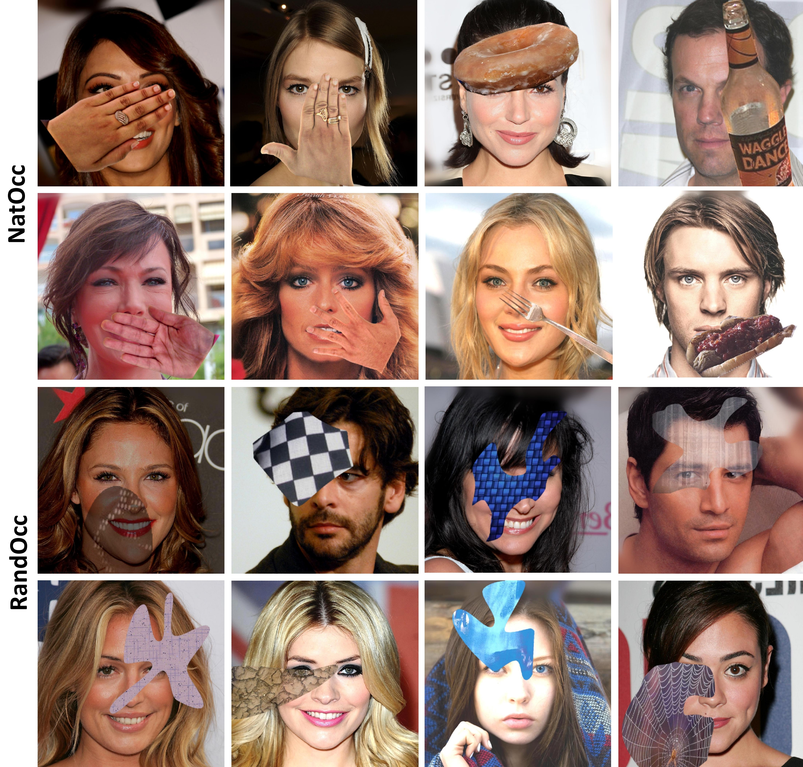
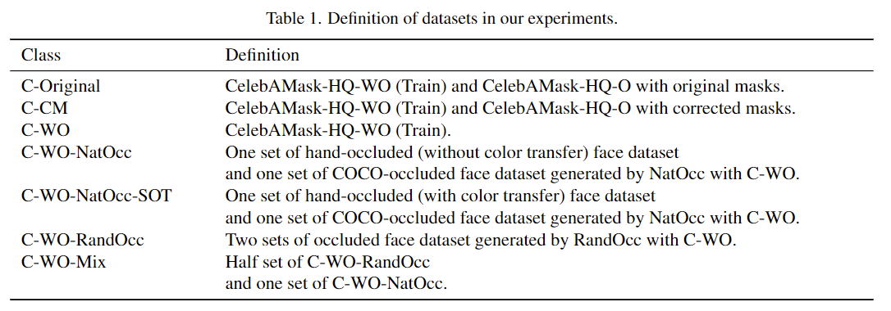
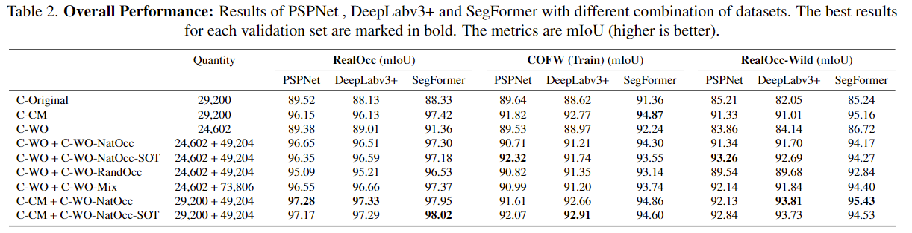

# Delving into High-Quality Synthetic Face Occlusion Segmentation Datasets



This repository provides the dataset and code for the following paper:

**Delving into High-Quality Synthetic Face Occlusion Segmentation Datasets**  
Kenny T. R. Voo, [Liming Jiang](https://liming-jiang.com/) and [Chen Change Loy](http://personal.ie.cuhk.edu.hk/~ccloy/)  
In CVPRW 2022.  
[**Dataset**](https://drive.google.com/drive/folders/15nZETWlGMdcKY6aHbchRsWkUI42KTNs5?usp=sharing) | Paper

> **Abstract:** *This paper performs comprehensive analysis on datasets for occlusion-aware face segmentation, a task that is crucial for many downstream applications. The collection and annotation of such datasets are time-consuming and labor-intensive. Although some efforts have been made in synthetic data generation, the naturalistic aspect of data remains less explored. In our study, we propose two occlusion generation techniques, Naturalistic Occlusion Generation (NatOcc), for producing high-quality naturalistic synthetic occluded faces; and Random Occlusion Generation (RandOcc), a more general synthetic occluded data generation method. We empirically show the effectiveness and robustness of both methods, even for unseen occlusions. To facilitate model evaluation, we present two high-resolution real-world occluded face datasets with fine-grained annotations, RealOcc and RealOcc-Wild, featuring both careful alignment preprocessing and an in-the-wild setting for robustness test. We further conduct a comprehensive analysis on a newly introduced segmentation benchmark, offering insights for future exploration.*


## Updates
- [04/2022] The RealOcc and RealOcc-Wild datasets are released. 
- [04/2022] This paper is accepted by **CVPRW 2022**.


## Result
**Dataset Definition**  


**Qualitative Result**  


**Quantitative Result**  




## Todo
- [ ] code release.


## Citation
If you find this work useful for your research, please consider citing our paper:  
```bibtex
@inproceedings{voo2022delving,
  title={Delving into High-Quality Synthetic Face Occlusion Segmentation Datasets},
  author={Voo, Kenny T. R. and Jiang, Liming and Loy, Chen Change},
  booktitle={Proceedings of the IEEE/CVF Conference on Computer Vision and Pattern Recognition (CVPR) Workshops},
  year={2022}
}
```
